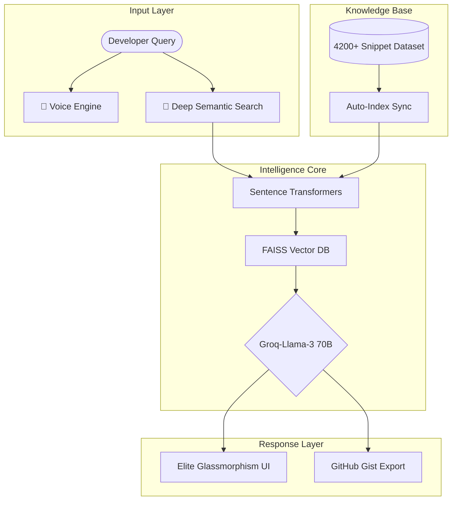

# 🚀 CodeX Intelligence Hub

<div align="center">
  
  
  
  
</div>

---

## 🌟 Overview

**CodeX Intelligence Hub** is an enterprise-grade AI ecosystem designed to revolutionize the developer workflow. Unlike traditional snippet managers, CodeX acts as an autonomous intelligence layer—bridging the gap between static documentation and real-time execution.

By leveraging **Retrieval-Augmented Generation (RAG)** powered by **FAISS**, and ultra-low latency inference via **Groq**, the hub provides instant, context-aware code solutions, deep logic analysis, and cross-language intelligence.

---

## 🛠️ Performance Architecture

CodeX is built on a high-availability RAG pipeline designed for sub-second retrieval across massive multidimensional vector spaces.



---

## 🔥 Key Intelligence Modules

### 🔍 1. Neural Code Search
Universal semantic search that understands "intent" rather than just keywords. Search for *"How to balance a red-black tree"* and get C++, Java, and Python solutions instantly.

### 🔄 2. Polyglot Bridge
Enterprise-level code translation. Move legacy C++ blocks to modern JavaScript or Python while maintaining algorithmic complexity and memory safety.

### 🐛 3. Bug Intelligence (Deep-RAG)
Analyze logic flaws by cross-referencing your code against a knowledge base of 277,000+ known bug patterns. Get AI-driven patches and root-cause analysis.

### 🧪 4. Execution Sandbox
Test generated snippets in a secure, isolated environment. Get real-time stdout/stderr capture without leaving the hub.

---

## 🏁 Installation & Setup

### 📦 Automated Setup (Recommended)
We recommend using a virtual environment to ensure dependency isolation.

```bash
# Clone the repository
git clone https://github.com/vinaykr8807/Code-snippet-recommender.git
cd Code-snippet-recommender

# Create and activate environment
python -m venv venv
source venv/bin/activate  # On Windows: .\venv\Scripts\activate

# Install core dependencies
pip install -r requirements.txt
```

### 🔑 Environment Configuration
Create a `.env` file in the root directory:
```env
GROQ_API_KEY=your_key_here
GITHUB_TOKEN=optional_for_gist_export
```

---

## 📊 Dataset Distribution

Current Intelligence Node Density:
- **Python Core**: 1,600+ Solutions (Optimization-focused)
- **C++/Algorithms**: 1,500+ CP-Grade Snippets
- **Java/Enterprise**: 850+ OOP Design Patterns
- **JS/Modern Utility**: 110+ ES2024 snippets

---

## 🗺️ Development Roadmap

- [ ] **Phase 1**: (Current) Core RAG & Multi-lang support. ✅
- [ ] **Phase 2**: Real-time collaborative "Pair Programming" mode.
- [ ] **Phase 3**: IDE Extension (VS Code / JetBrains) for direct integration.
- [ ] **Phase 4**: Local LLM support via Ollama for offline environments.

---

## 🤝 Contributing

We welcome contributions from the global developer community. Please read our [CONTRIBUTING.md](CONTRIBUTING.md) for details on our code of conduct and the process for submitting pull requests.

## 📜 License

This project is licensed under the MIT License - see the [LICENSE](LICENSE) file for details.

---

<p align="center">
  <b>Built with Intelligence for Developers</b><br>
  Maintainer: <a href="https://github.com/vinaykr8807">vinaykr8807</a>
</p>